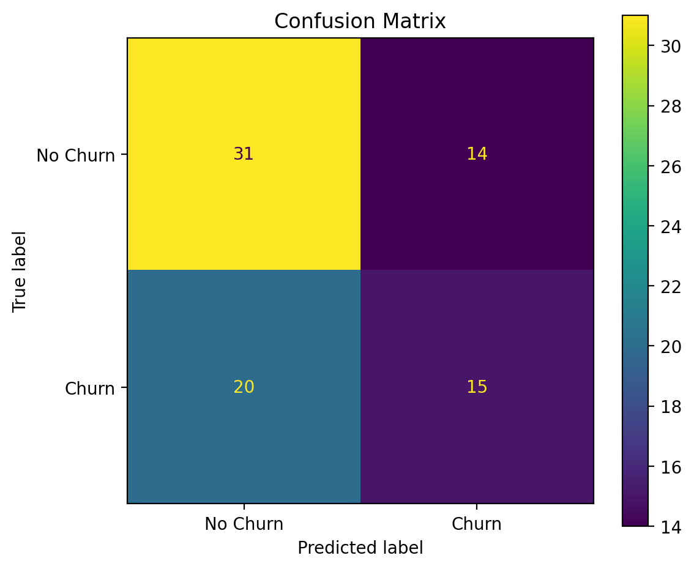
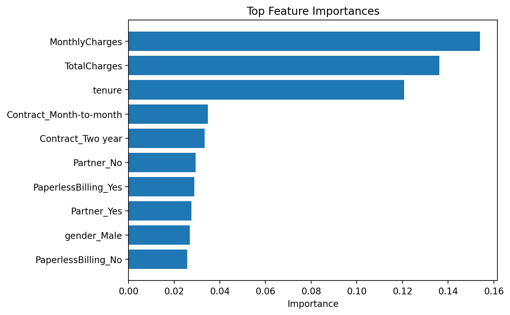

A machine learning project that predicts customer churn using classification techniques, with model evaluation and visualization.
# 📊 Customer Churn Prediction System

A machine learning project that predicts customer churn using classification techniques, with model evaluation and visualization.

---

## 🚀 Overview

This project demonstrates a complete machine learning workflow, including data preprocessing, model training, evaluation, and visualization.

---

## ✨ Features

- Data preprocessing and cleaning  
- Categorical encoding  
- Model training using Random Forest  
- Performance evaluation (Accuracy, Precision, Recall, F1 Score)  
- Confusion matrix visualization  
- Feature importance analysis  

---

## 📊 Model Evaluation

### Confusion Matrix

### Feature Importance

---

## 🛠 Tech Stack

- Python  
- Pandas  
- Scikit-learn  
- Matplotlib  

---

## ▶️ How to Run

bash
pip install -r requirements.txt
python src/main.py
📁 Project Structure
src/
assets/
requirements.txt
README.md
📌 Use Case
Helps businesses identify customers likely to leave and take preventive actions.

Danyal Hendousinabad
